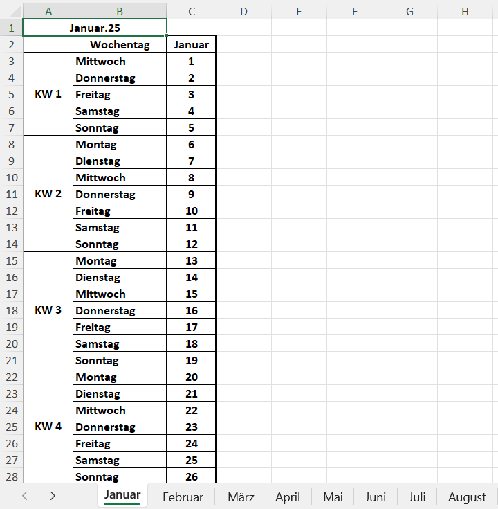

# Excel Calendar Generator

Generates yearly Excel calendars with calendar weeks (KW) and data validation for time tracking.

## Features

- Generates one Excel file per year
- Shows calendar weeks (KW)
- German weekday names
- Data validation limiting "u" and "x" entries to maximum 8 per row
- Bold text formatting
- Thin borders with thick right border
- Merged cells for calendar weeks
- Centered text alignment

## Requirements

```bash
pip install pandas openpyxl
```

## Usage

1. Run the script:
```bash
python calendar_generator.py
```

2. Enter the desired year when prompted
3. Find the generated Excel file named `Kalender_YYYY.xlsx` in your working directory

## Excel Structure

- Columns:
  - A: Calendar Week (KW)
  - B: Weekday
  - C: Day of Month
  - D-AG: Data validation cells for entries

- Data Validation:
  - Allows "u" and "x" entries
  - Maximum 8 entries per row
  - Error message: "Für diesen Tag ist das Kontingent bereits aufgebraucht. Kein Eintrag mehr möglich."

## Example Output



## Notes

- All text is in German
- Each month is on a separate worksheet
- Calendar weeks are automatically calculated
- Years before 1900 are not supported due to Excel limitations
- Code was created together with Claude.ai
